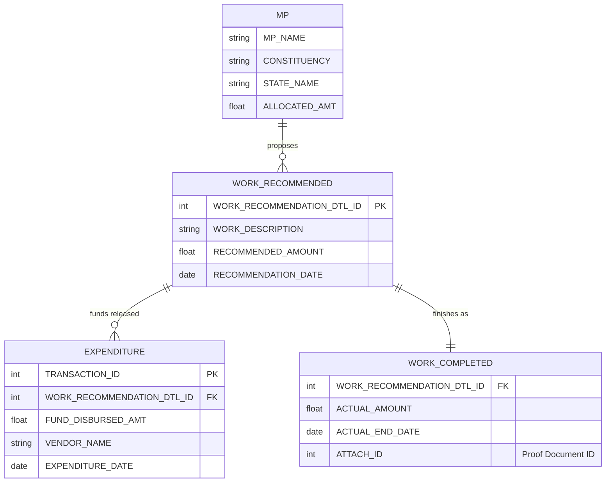

# Data Analysis & Understanding

## Datasets Overview

We have 4 core datasets from the MoSPI MPLADS API.

### 1. Allocated Limit (`allocated_limit.json`)
*   **Purpose:** Shows the total funds allocated to each MP.
*   **Key Fields:** `MP_NAME`, `CONSTITUENCY`, `STATE_NAME`, `ALLOCATED_AMT`.
*   **Grain:** One record per MP.
*   **Volume:** ~544 records.

### 2. Works Recommended (`total_works_recommended.json`)
*   **Purpose:** The master list of all projects proposed by MPs.
*   **Key Fields:** 
    *   `WORK_RECOMMENDATION_DTL_ID` (Primary Key)
    *   `RECOMMENDED_AMOUNT`
    *   `WORK_DESCRIPTION`
    *   `RECOMMENDATION_DATE`
    *   `IDA_NAME` (District Authority)
*   **Grain:** One record per proposed work.
*   **Volume:** ~73,700 records.

### 3. Total Expenditure (`total_expenditure.json`)
*   **Purpose:** Tracks actual money released/spent for works.
*   **Key Fields:**
    *   `WORK_RECOMMENDATION_DTL_ID` (Foreign Key to Recommended)
    *   `FUND_DISBURSED_AMT`
    *   `VENDOR_NAME`
    *   `EXPENDITURE_DATE`
*   **Grain:** Transaction level (multiple per work).
*   **Volume:** ~43,700 records.

### 4. Works Completed (`total_works_completed.json`)
*   **Purpose:** Tracks works that are officially marked as done.
*   **Key Fields:**
    *   `WORK_RECOMMENDATION_DTL_ID` (Foreign Key)
    *   `ACTUAL_AMOUNT`
    *   `ACTUAL_END_DATE`
    *   `ATTACH_ID` (Proof of completion)
*   **Grain:** One record per completed work.
*   **Volume:** ~11,000 records.

## Entity Relationship Diagram (ERD)

## Critical Metrics to Compute

1.  **Utilization Rate:** `Total Expenditure / Allocated Amount` (per MP).
2.  **Completion Rate:** `Count(Works Completed) / Count(Works Recommended)` (per MP).
3.  **Transparency Score:** `% of Completed Works with ATTACH_ID` (per MP).
4.  **Vendor Concentration:** Top vendors receiving funds per Constituency.
5.  **Cost Efficiency:** `ACTUAL_AMOUNT` vs `RECOMMENDED_AMOUNT` delta.

## Data Strategy
*   **Storage:** SQLite (single file `govwork.db`).
*   **ETL:** Python script to load JSONs, clean types, and normalize into SQL tables.
*   **Caching:** The database *is* the cache. ETL runs only when we explicitly fetch fresh data.
